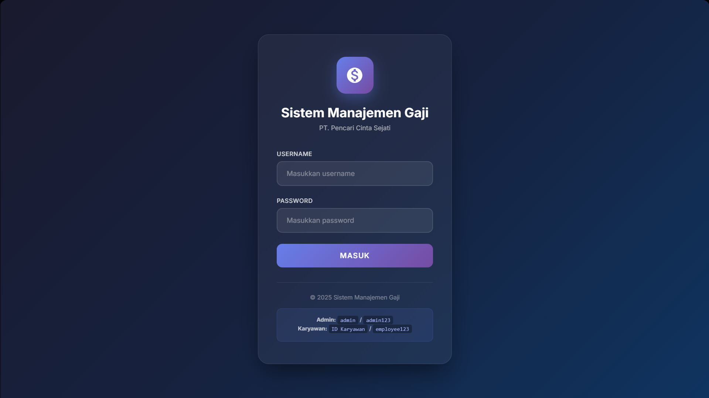
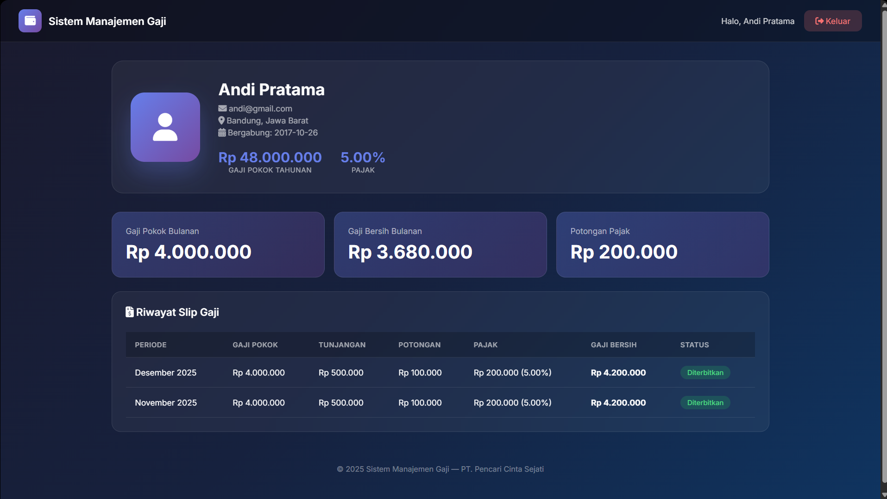
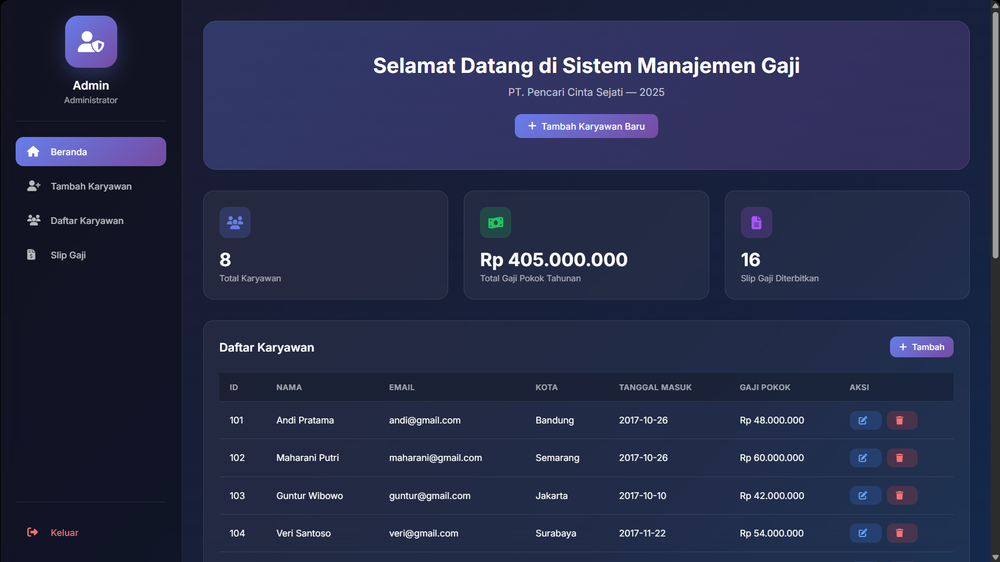

# Sistem Managemen Gaji Sederhana

Project ini merupakan project sederhana yang dibuat untuk keperluan belajar, bukan untuk komersial.
Kode dikembangkan dan dimodifikasi dari project yang sudah dibuat oleh Arsh Boparai di https://github.com/arsh-boparai/payroll-management-system

Berbasis PHP and MySQL

## Requirement
1. PHP 5 keatas
2. MySQL

Koneksi dari PHP ke MySQL sudah menggunakan mysqli

## Akun Login

**Admin:**
- Username: `admin`
- Password: `admin123`

**Karyawan:**
- Username: ID karyawan (`101` - `108`)
- Password: `employee123`

## Screenshots

